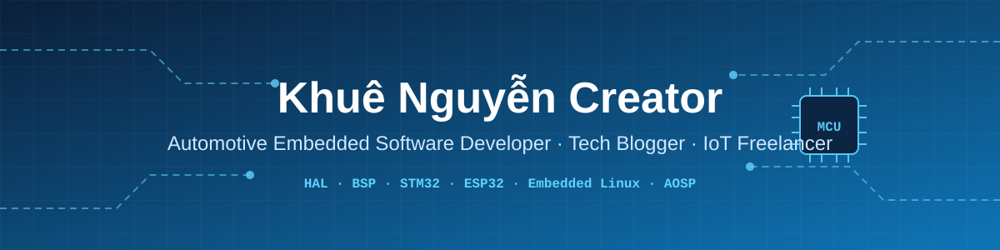
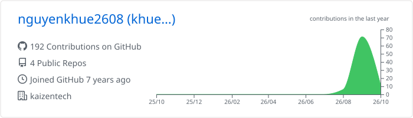
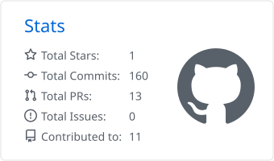
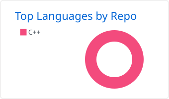

  

<h1 align="center">Hi 👋, I'm Khuê Nguyễn Creator</h1>
<h3 align="center">Automotive Embedded Software Developer | Tech Blogger | IoT Freelancer</h3>

  
  
  

---

### 🏢 Blog Source Code
> 📢 All source code examples, course materials and hardware tutorials from my blog **[khuenguyencreator.com](https://khuenguyencreator.com/)** are published on a dedicated GitHub account.
>
> 👉 **Browse the code here: [github.com/khuenguyencreator](https://github.com/khuenguyencreator)**

  
  

---

### 🚀 About Me
I am an **Embedded Software Engineer** in the **Automotive industry**, focusing on **Hardware Abstraction Layer (HAL)** development and **Board Support Package (BSP)** customization. Alongside my professional career, I run a technology blog to share knowledge and support the Vietnamese embedded developer community.

- 🛠️ **Current focus:** Automotive firmware architecture, MCAL/HAL layer isolation, BSP development for heterogeneous SoCs, and real-time execution.
- 🌱 **Learning:** Automotive Ethernet, AUTOSAR basics, Functional Safety (ISO 26262), and Linux kernel driver development.
- 📝 **Technical blog:** [khuenguyencreator.com](https://khuenguyencreator.com/) — tutorials on MCUs, Embedded Linux and Automotive systems.
- 💬 **Ask me about:** STM32 peripherals, ESP32 IoT platforms, HAL optimization and PCB layout.
- 📫 **Contact:** [khuenguyencreator@gmail.com](mailto:khuenguyencreator@gmail.com)

---

### 🛠️ Tech Stack & Tools

**Programming**

**Automotive & Embedded**

**Operating Systems**

**Tools & Platforms**

---

### 📊 GitHub Stats

<!-- Cards are generated daily by .github/workflows/profile-metrics.yml -->

  <picture>
    <source media="(prefers-color-scheme: dark)" srcset="./profile-summary-card-output/github_dark/0-profile-details.svg" />
    
  </picture>

  <picture>
    <source media="(prefers-color-scheme: dark)" srcset="./profile-summary-card-output/github_dark/3-stats.svg" />
    
  </picture>
  <picture>
    <source media="(prefers-color-scheme: dark)" srcset="./profile-summary-card-output/github_dark/1-repos-per-language.svg" />
    
  </picture>

---

### 🤝 Connect with Me

  
  
  
  
  

